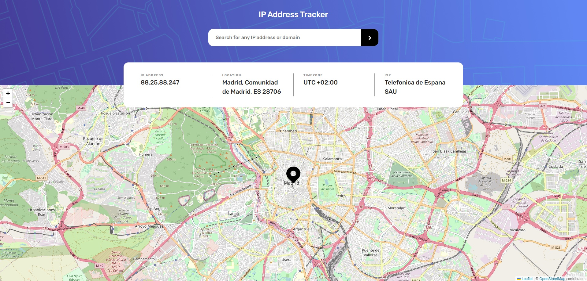

## Table of contents

- [Overview](#overview)
  - [The challenge](#the-challenge)
  - [Screenshot](#screenshot)
  - [Links](#links)
- [My process](#my-process)
  - [Built with](#built-with)
  - [What I learned](#what-i-learned)
  - [Continued development](#continued-development)
  - [Useful resources](#useful-resources)
- [Author](#author)
- [Acknowledgments](#acknowledgments)

## Overview

### The challenge

Users should be able to:

- View the optimal layout for each page depending on their device's screen size
- See hover states for all interactive elements on the page
- See their own IP address on the map on the initial page load
- Search for any IP addresses or domains and see the key information and location

### Screenshot

Add a screenshot of your solution. The easiest way to do this is to use Firefox to view your
project, right-click the page and select "Take a Screenshot". You can choose either a full-height
screenshot or a cropped one based on how long the page is. If it's very long, it might be best to
crop it.

Alternatively, you can use a tool like [FireShot](https://getfireshot.com/) to take the screenshot.
FireShot has a free option, so you don't need to purchase it.

Then crop/optimize/edit your image however you like, add it to your project, and update the file
path in the image above.

**Note: Delete this note and the paragraphs above when you add your screenshot. If you prefer not to
add a screenshot, feel free to remove this entire section.**

### Links

- [Solution URL](https://github.com/KrzysztofRozbicki/fem-challenge-16)
- [Live Site URL](https://krzysztofrozbicki.github.io/fem-challenge-16/)

## My process

### Built with

- Semantic HTML5 markup
- CSS custom properties
- Flexbox
- CSS Grid
- Mobile-first workflow
- [React](https://reactjs.org/) - JS library

### What I learned

This project was quite basic and kind of a training with using API and React - together with
useState, useEffect and useContext hooks.

### Continued development

Would like to attach the IP WebApi without 1000 one time limit.

### Useful resources

- [Example resource 1](https://www.example.com) - This helped me for XYZ reason. I really liked this
  pattern and will use it going forward.
- [Example resource 2](https://www.example.com) - This is an amazing article which helped me finally
  understand XYZ. I'd recommend it to anyone still learning this concept.

## Author

- GitHub - [GitHub](https://github.com/KrzysztofRozbicki)
- Website - [Pogbit](https://www.pogbit.com/)
- Frontend Mentor - [@KrzysztofRozbicki](https://www.frontendmentor.io/profile/KrzysztofRozbicki)

## Acknowledgments

Thanks goes to [GoIt](https://goit.global/pl/) for the great course where in just 12 weeks I have
learned almost full HTML/CSS so i can make these challenges without much struggle!
